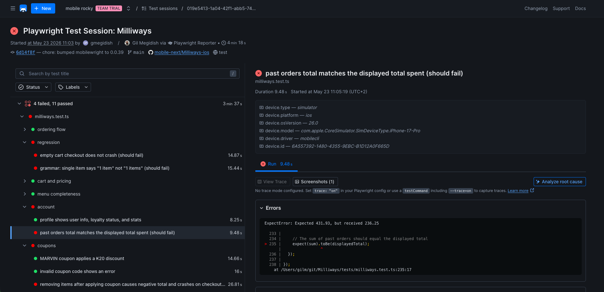

# Checkly

[Checkly](https://checklyhq.com) is a Playwright-native test reporting platform. Unlike CI-only tools, it stores screenshots, traces, and console output alongside test results — making failures easy to investigate without leaving your browser.



## Setup

### 1. Install the reporter

```bash
npm install --save-dev @checkly/playwright-reporter
```

### 2. Add the reporter to your config

Import `createChecklyReporter` and add it to the `reporter` array in `mobilewright.config.ts`:

```ts
import { defineConfig } from 'mobilewright';
import { createChecklyReporter } from '@checkly/playwright-reporter';

export default defineConfig({
  reporter: [
    ['list'],
    createChecklyReporter({
      sessionName: 'Smoke suite',
    }),
  ],
});
```

### 3. Set credentials

The reporter reads your Checkly credentials from environment variables:

```bash
export CHECKLY_API_KEY=<your-api-key>
export CHECKLY_ACCOUNT_ID=<your-account-id>
```

Then run your tests as usual:

```bash
npx mobilewright test
```

Results are uploaded automatically at the end of the run.

### 4. View results

Open on **Test Sessions** on the left sidebar, and you will see the uploaded report.

## Configuration

Pass options to `createChecklyReporter()` for full IDE intellisense:

| Option | Type | Description |
|---|---|---|
| `sessionName` | `string` | Name shown in the Checkly dashboard for this run |
| `outputDir` | `string` | Directory for report output. Defaults to Playwright's `outputDir` |
| `dryRun` | `boolean` | Generate the report locally without uploading |
| `verbose` | `boolean` | Show worker stdout/stderr in the terminal. Defaults to `true` |
| `showProgress` | `boolean` | Print real-time test progress. Defaults to `true` |
| `showSummaryTable` | `boolean` | Print a per-project summary table at the end. Defaults to `true` |
| `scrubbing` | `ScrubbingOptions \| false` | Scrub secrets from reports. Auto-detects common patterns by default |

## CI example (GitHub Actions)

```yaml
- name: Run Mobilewright tests
  env:
    CHECKLY_API_KEY: ${{ secrets.CHECKLY_API_KEY }}
    CHECKLY_ACCOUNT_ID: ${{ secrets.CHECKLY_ACCOUNT_ID }}
  run: npx mobilewright test
```
