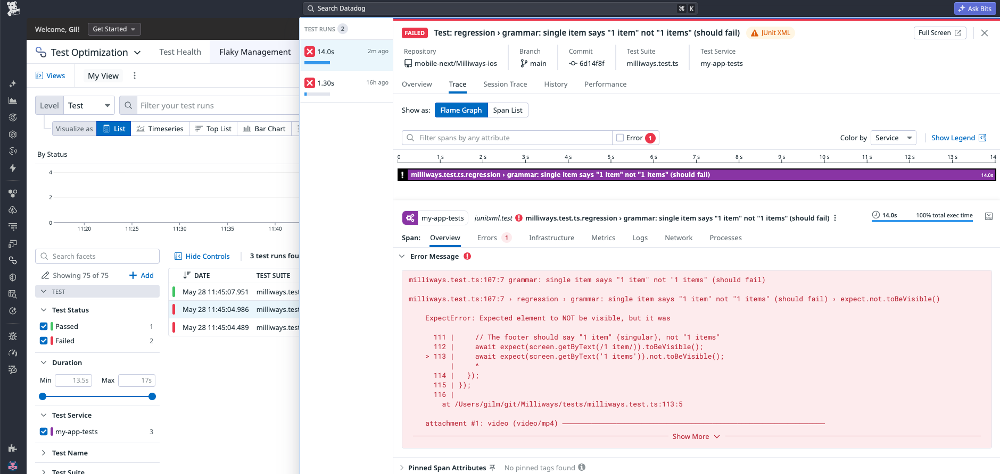

# Datadog

Mobilewright integrates with [Datadog Test Run](https://docs.datadoghq.com/tests/) to track test results, flakiness trends, and pass/fail rates over time.

:::note
Datadog Test Optimization collects metrics and traces — it does **not** store screenshots, videos, or view trees. Those artifacts remain in the local HTML report. If you need hosted screenshots alongside test results, consider a Playwright-native reporting platform instead.
:::



## Setup

### 1. Install the Datadog CI tool

```bash
npm install --save-dev @datadog/datadog-ci
```

### 2. Add the JUnit reporter

Add the `junit` reporter to `mobilewright.config.ts`:

```ts
reporter: [
  ['list'],
  ['junit', { outputFile: 'test-results.xml' }],
],
```

### 3. Run tests and upload

```bash
npx mobilewright test

DD_API_KEY=<your-api-key> \
npx datadog-ci junit upload \
  --service my-app-ios-tests \
  --tags platform:ios \
  test-results.xml
```

Datadog auto-detects CI environment variables (GitHub Actions, GitLab CI, CircleCI, etc.) and tags the test run accordingly.

### 4. View results

Open **Software Delivery → Test Optimization → Runs ** in Datadog to see test runs, flaky test detection, and duration trends.

## CI example (GitHub Actions)

```yaml
- name: Run Mobilewright tests
  run: npx mobilewright test

- name: Upload results to Datadog
  if: always()
  env:
    DD_API_KEY: ${{ secrets.DD_API_KEY }}
  run: |
    npx datadog-ci junit upload \
      --service my-app-ios-tests \
      --tags platform:ios \
      test-results.xml
```

The `if: always()` ensures results are uploaded even when tests fail.

## Configuration

| Option | Description |
|---|---|
| `--service` | Service name shown in Test Optimization (e.g. `my-app-ios-tests`) |
| `--tags` | Comma-separated key:value tags (e.g. `platform:ios,env:ci`) |
| `DD_API_KEY` | Your Datadog API key |
| `DD_ENV` | Environment tag (e.g. `ci`, `staging`) |
